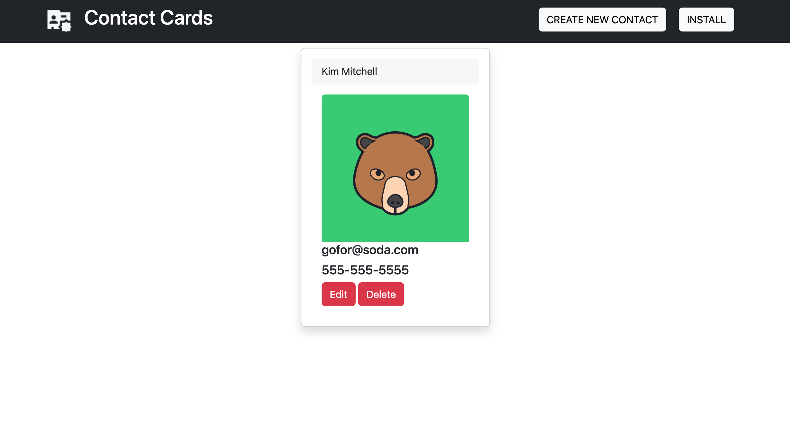

# Contact Cards

## Description
A progressive web application that manages a company's employee cards using webpack, IndexedDB and Workbox. Users have offline capabilities - the application can be installed and run locally on a user's device.

## Table of Contents
[Deployed Application](#deployed-application)  
[Built With](#built-with)  
[Landing Page](#landing-page)  
[Installation Instructions](#installation-instructions)  
[Contribution](#contribution) 

## Deployed Application
https://gentle-castle-11300.herokuapp.com/

## Built With
* Node.js
* Express
* Webpack
* IndexedDB
* Workbox
* Concurrently
* Babel
* HTML
* CSS
* Bootstrap
* Heroku

## Landing Page

## Installation Instructions  

* Node.js must be installed to run this application locally.
* Node.js can be downloaded and installed from https://nodejs.org/en/download/  
* To install the required npm packages, enter `npm install` in the command line while in the root folder
* Enter `npm start` in the command line while in the root folder to launch the application at `http://localhost:3001/` in the browser

## Contribution
Made with ❤️ by Dylan Hay